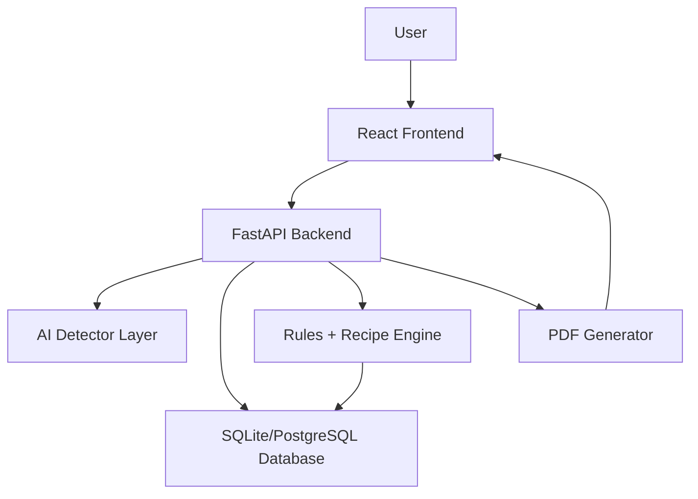

# FoodLoop AI Architecture

FoodLoop AI turns food waste images into practical transformation recipes. The MVP uses a mock detector and template recipe engine so the full product flow works before real model integration.

## Product Flow

1. User uploads an image or captures a photo in the React frontend.
2. Frontend sends multipart form data to the FastAPI backend.
3. Backend validates and stores the image.
4. Backend creates a waste analysis batch in the database.
5. Backend runs the configured detector through a stable detector interface.
6. Detector returns normalized waste items, confidence scores, area estimates, and contamination flags.
7. Backend stores detected items and maps labels to known materials.
8. Recipe engine reads material profiles and recipe rules from the database.
9. Backend returns ranked recipe recommendations.
10. User confirms or corrects detections.
11. Backend stores feedback and can regenerate recommendations.
12. User selects a recommendation.
13. Backend generates structured recipe JSON from approved templates/rules.
14. Backend generates a ReportLab PDF.
15. Frontend shows recipe preview and download actions.

## System Boundaries

The frontend never talks directly to the database, detector, or recipe AI. It only calls backend API routes.



## Frontend

Stack:

- React
- Vite
- Tailwind CSS
- React Router
- Axios or TanStack Query
- Recharts
- Browser camera API

Responsibilities:

- Display upload and camera flows.
- Show analysis status, detections, confidence, and contamination warnings.
- Let users correct detected labels.
- Show ranked recipe recommendations from backend data.
- Preview generated recipes.
- Download PDFs from backend routes.
- Show history, materials, recipe templates, and dashboard analytics.

Frontend folder shape:

```text
frontend/
  src/
    api/
    components/
    pages/
    routes/
    utils/
    App.jsx
    main.jsx
    index.css
```

## Backend

Stack:

- FastAPI
- SQLAlchemy ORM
- Alembic migrations
- Pydantic schemas
- SQLite locally, PostgreSQL-ready through DATABASE_URL
- ReportLab PDF generation

Backend responsibilities:

- Validate and store uploaded images.
- Create waste batches.
- Run mock or YOLO detector.
- Normalize detected labels into known materials.
- Store detections, corrections, generated recipes, PDFs, and dashboard data.
- Rank recipe recommendations from database rules.
- Generate safe structured recipes.
- Generate and serve PDFs.

Backend folder shape:

```text
backend/
  app/
    api/
    ai/
    core/
    database/
    schemas/
    services/
    uploads/
    generated_pdfs/
    main.py
  alembic/
  requirements.txt
```

## Data Model

Core tables:

- users
- images
- waste_batches
- materials
- detected_items
- recipe_types
- material_recipe_rules
- generated_recipes
- recipe_pdfs
- feedback

## AI Strategy

Detector interface:

```python
analyze_image(image_path) -> list[DetectedWasteItem]
```

Modes:

- `mock`: deterministic MVP detections.
- `yolo`: future Ultralytics YOLO detection or segmentation.

Recipe generation is hybrid:

- Database rules decide what is allowed.
- Ranker scores recipe types.
- Template engine generates structured recipe JSON.
- Optional LLM later formats and personalizes approved recipes only.

## MVP Milestones

1. Project setup and app shell.
2. Upload and camera flow.
3. Mock detector and analysis result.
4. Seeded materials and recipe rules.
5. Recipe recommendation engine.
6. Structured recipe generation.
7. PDF generation and download.
8. Correction and feedback.
9. Dashboard and history.
10. YOLO detector integration.
11. Docker and deployment prep.
